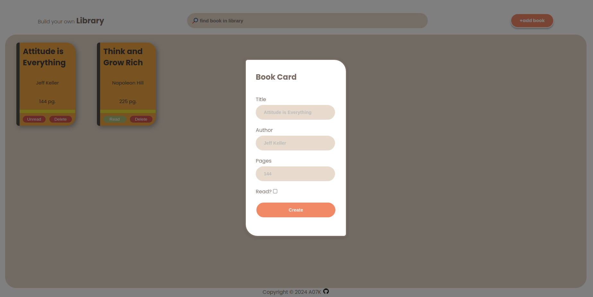

# <a href="https://a07k.github.io/Project-Library/">Project Library</a>

  <h2>Description</h2>
    
This project is an interactive Library Management System implemented using HTML, CSS, and JavaScript. It allows users to add, display, search, and manage books in a virtual library.

  <h2>Features</h2>
    <ul>
        <li>Add new books to the library</li>
        <li>Display books as interactive cards</li>
        <li>Search functionality to filter books by title or author</li>
        <li>Toggle read/unread status for each book</li>
        <li>Delete books from the library</li>
        <li>Empty library message when no books are present</li>
    </ul>

  <h2>How to Use</h2>
    <ol>
        <li>Click the "Add Book" button to open the dialog for adding a new book</li>
        <li>Fill in the book details (title, author, number of pages, read status)</li>
        <li>Click "Create" to add the book to your library</li>
        <li>Use the search bar to find specific books</li>
        <li>Toggle the read status or delete books using the buttons on each book card</li>
    </ol>

  <h2>Technical Details</h2>
    <ul>
        <li>Books are stored in an array and displayed as DOM elements</li>
        <li>Uses a Book constructor function with prototype methods</li>
        <li>Implements event listeners for user interactions</li>
        <li>Utilizes DOM manipulation for dynamic content updates</li>
        <li>Employs a dialog element for the book creation form</li>
    </ul>

  <h2>Future Improvements</h2>
    <ul>
        <li>Implement local storage to persist library data</li>
        <li>Add sorting options (e.g., by title, author, or read status)</li>
        <li>Implement user accounts and authentication</li>
        <li>Add book cover images and more detailed information</li>
        <li>Create a responsive design for mobile devices</li>
    </ul>
